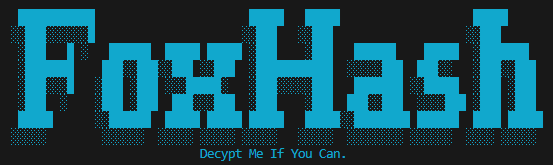

# FoxHash — Packer & Protected Python Runtime



---

## Overview

FoxHash is a lightweight packer for Python scripts that compiles, compresses, and embeds a script into a self-contained loader. The original source is kept encrypted inside the packed file and can be recovered only with the correct seed. The project is designed for secure single-file distribution, limited-access prototyping, and educational/research usage such as CTFs or secure demo scenarios.

This README explains what FoxHash does, its main advantages and limitations, recommended uses, and step-by-step instructions for packaging and recovering scripts. No source code is shown in the README — only usage guidance and conceptual explanations.

---

## Key Features

- **Single-file packaging**: Produces a single Python file that runs as-is, while the original source is embedded encrypted.
- **Encryption modes**:
  - AES-GCM when the `cryptography` package is available (recommended).
  - HMAC-based keystream fallback when AES-GCM is not available.
- **Seed-based recovery**: A KDF-derived seed is required to decrypt and recover the original source.
- **Autodel**: Optionally delete the packed file after a configured number of runs.
- **Anti-bruteforce locking**: Locks a packed file after a configurable number of failed recovery attempts.
- **Interactive CLI**: A menu-driven interface for packing and recovering without memorizing commands.
- **Optional auto-dependency installation**: Attempts to install third-party dependencies (e.g., `colorama`, `cryptography`) when needed.

---

## Advantages

1. **Convenience**: Distributes Python programs as a single file while keeping the original source encrypted.
2. **Robust key derivation**: Uses a combined hashing strategy with a PBKDF to derive encryption keys from seeds.
3. **Operational controls**: Autodel and lock features provide operational limits suitable for demos, ephemeral access, or challenge deployment.
4. **Graceful fallback**: Provides functionality even in environments where advanced crypto libraries are unavailable.
5. **User-friendly**: Interactive menus and clear prompts minimize errors during packing and recovery.

---

## Limitations & Security Considerations

- **Not a perfect protection**: Determined attackers with access to the packed file and runtime can analyze or extract bytecode. Treat FoxHash as an obfuscation/protection layer, not an impenetrable vault.
- **Custom fallback is weaker**: The HMAC-based stream fallback is less robust than AES-GCM. Use AES-GCM whenever possible.
- **Auto-installer caveats**: Automatic pip installs may fail in offline or permission-restricted environments and may alter the target environment unexpectedly.
- **Dual-use risk**: The tool can be misused to hide malicious code. Only use it on code you own or in environments where you have explicit permission.

---

## Recommended Use Cases

- **Internal distribution**: Shipping internal scripts to teammates without publishing source code to public repositories.
- **CTF challenges**: Packaging a challenge with hidden source that the player must reveal by discovering the seed or vulnerability.
- **Time-limited demos**: Delivering ephemeral scripts that self-delete after a specified number of runs.
- **Educational/research**: Teaching packing, KDF, and basic runtime protection concepts.

---

## Quick Usage Guide

### 1) Packing a script

- Run the tool via the interactive CLI or pass input/output arguments.
- Provide a seed (or let the packer generate a secure random seed). **Save the seed** — losing it means you will not be able to recover the original source.
- Choose KDF iterations (default: 200,000), autodel runs (0 to disable), and max failed reveal attempts for locking.

The interactive application will display a packing summary and print the reveal command. Example of the reveal command format:

```
python packed_script.py -fs "your-seed-here"
```

### 2) Running a packed script

- Execute the packed file normally with Python. The embedded runtime executes without requiring the seed for normal operation.

### 3) Recovering the original source

- Run the packed file with the reveal flag and the correct seed (the same seed used during packing). If the seed is correct, the original source is written to the current working directory with a `_recovered.py` suffix.

Example recovery command (format shown above):

```
python packed_script.py -fs "your-seed-here"
```

### 4) Operational behaviors

- **Autodel**: When enabled, the packed file will attempt to delete itself after the configured number of runs.
- **Max-fails / Lock**: After the configured number of failed recovery attempts, the file becomes locked and further recovery attempts will be rejected until state is reset.

---

## Troubleshooting

- **Recovery fails**:
  - Verify the exact seed used at packing time (seeds are case-sensitive).
  - Confirm KDF iteration parameters match if you customized them.
- **Dependency installation errors**:
  - Install `cryptography` and `colorama` manually with pip in the target environment if automatic installation fails.
- **Autodel didn't delete**:
  - Ensure the process has write/delete permission in the file location and that the packed file is not in use by another process.

---

## Security & Ethics Statement

FoxHash is intended for legitimate uses: secure distribution, internal tooling, education, and challenge creation. Do not use FoxHash to conceal malicious code. Misuse is unethical and illegal. You are responsible for complying with laws and organizational policies.

---

## Contribution & Support

Contributions are welcome. When contributing:

- Open an issue describing the goal and threat models.
- Provide tests for cryptographic or state-related changes.
- Do not add features that explicitly facilitate covert distribution of malware.

If you would like a corporate-friendly version of this README or a professionally designed thumbnail, please raise an issue or submit a pull request.

---

## Contact

For questions, feature requests, or security concerns, please open an issue on the project repository or submit a pull request with proposed changes.

---

